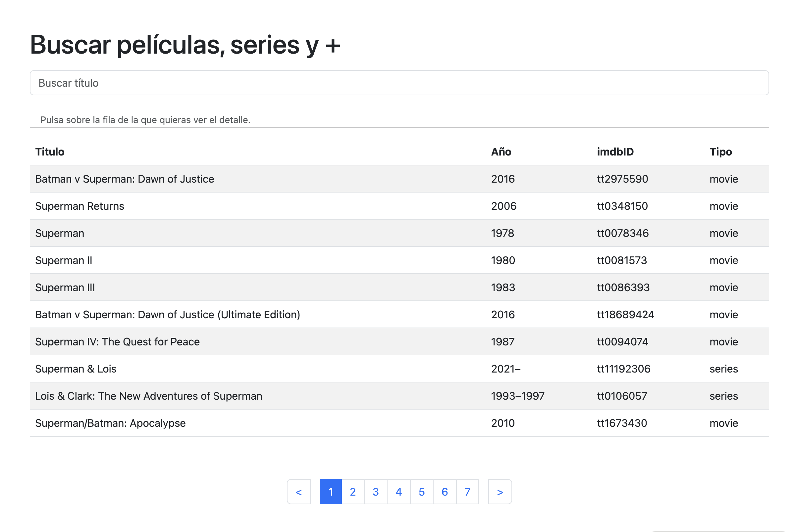
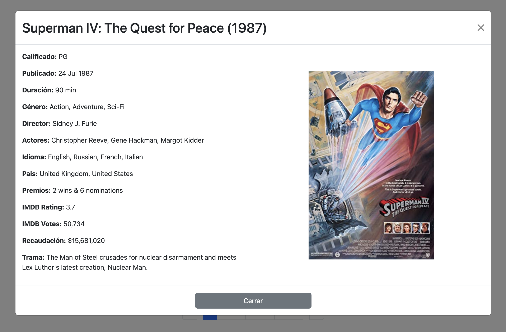

# Buscador de películas.

## Tabla de Contenidos

- [Descripción](#descripcion)
- [Demo en Vivo](#demo-en-vivo)
- [Tecnologías Utilizadas](#tecnologías-utilizadas)
- [Cómo Instalar](#cómo-instalar)
- [Cómo Usar](#cómo-usar)
- [Licencia](#licencia)
- [Contacto](#contacto)

## Descripción

Este es un ejemplo de como consumir una API pública y mostrar la información obtenida. Para ello usamos la API pública: [API OMDb](https://www.omdbapi.com).

Esta aplicación hace dos tipos de peticiones;
1. Búqueda de películas por título.
2. Detalle de la película seleccionada.

La API OMDb es un servicio web RESTful que obtiene información de peliculas, todos los contenidos e imágenes en el sitio son aportados y mantenidos por sus usuarios. 

Esta aplicación te devuelve los resultados de la búsqueda en páginas con 10 resultados cada una. La paginación es dinámica y tiene botones para ir al principio o al final. 

Se puede hacer click sobre uno de los resultados, lo que abrirá un modal con todos los detalles de la película, incluyendo una imágen de su cartel (si no tuviera, muestra una imagen genérica).

## Demo en Vivo

Puedes probar una versión en vivo del proyecto aquí: [Buscapelis](https://buscapelishergueta.000webhostapp.com/)

## Tecnologías Utilizadas

- JavaScript
- HTML
- Bootstrap 5
- Webpack

## Cómo Instalar

Pasos para instalar el proyecto, por ejemplo:

1. Clona el repositorio: `git clone https://github.com/ManuelHergueta/busca_peliculas`
2. Entra en el directorio raiz: `cd busca_peliculas`
3. Instala las dependencias: `npm install`

## Cómo Usar

Para usar el proyecto, una vez generadas las dependencias, en la terminal, estando en el directorio raiz, teclea: `npm run start`.
Esto abrirá tu navegador y te mostrará la aplicación.

## Licencia

Este proyecto está bajo licencia MIT - consulta el archivo [LICENSE.md](LICENSE.md) para más detalles.

## Contacto

Si te ha gustado esta aplicación y tienes alguna pregunta o sugerencia, puedes ponerte en contacto conmigo;
- [LinkedIn](https://www.linkedin.com/in/hergueta/) 
- Escribeme un email: manuel@hergueta.es

Estoy abierto a nuevas oportunidades y a recibir comentarios sobre mis proyectos.

---
© 2023 Manuel Hergueta. Todos los derechos reservados.